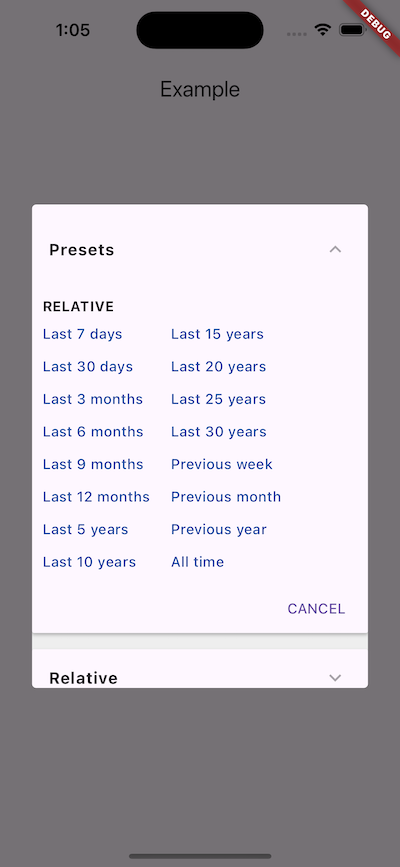

# extensive_date_range_picker

Flutter widget that provides an extensive date and time range picker.

[](https://app.travis-ci.com/github/larryaasen/extensive_date_range_picker)
[](https://app.codecov.io/gh/larryaasen/extensive_date_range_picker)
[](https://pub.dev/packages/extensive_date_range_picker)
<a href="https://www.buymeacoffee.com/larryaasen">
  
</a>

Works on Android, iOS, desktop, and web.

There are three types of date range inputs that are supported at all times: presets, relative, and date range.
It uses an accordian style interface to switch between the types of date range input.
This provides the user with the greatest range of choices in creating date ranges.

## Presets



## Relative


## Date Range


## Installation

Install the latest version from [pub.dev](https://pub.dev/packages/extensive_date_range_picker/install).

## Examples

The dialog can be displayed with this simple call to `showDateRangeDialog`.
```Dart
showDateRangeDialog(context: context);
```

To get the results back from the dialog, use the range returned from the future.
```Dart
DateTimeRangePhrase _selectedRange = DateTimeRangePreset.allTime;

onTap: () {
    DateTimeRangePhrase _selectedRange = DateTimeRangePreset.allTime;

    showDateRangeDialog(context: context, initialRange: _selectedRange)
        .then((range) => setState(() => _selectedRange = range ?? _selectedRange));
}
```

Here is a complete example.
```Dart
class MyHomePage extends StatefulWidget {
  final String title;
  MyHomePage({Key key, this.title}) : super(key: key);

  @override
  _MyHomePageState createState() => _MyHomePageState();
}

class _MyHomePageState extends State<MyHomePage> {
  DateTimeRangePhrase _selectedRange = DateTimeRangePreset.allTime;

  @override
  Widget build(BuildContext context) {
    return Scaffold(
      appBar: AppBar(title: Text(widget.title)),
      body: Center(
        child: Column(
          mainAxisAlignment: MainAxisAlignment.center,
          children: <Widget>[
            CustomDropdownButton(
              hint: "Select date range",
              value: _selectedRange.phrase(),
              iconSize: 24,
              isDense: false,
              underline: Container(height: 1, color: Colors.blueAccent),
              onTap: () {
                showDateRangeDialog(context: context, initialRange: _selectedRange)
                    .then((range) => setState(() => _selectedRange = range ?? _selectedRange));
              },
            ),
          ],
        ),
      ),
    );
  }
}
```

## Apps that use extensive_date_range_picker.dart

### US Debt Now

This widget is currently used in the US Debt Now app on
[Android](https://play.google.com/store/apps/details?id=com.moonwink.treasury)
and [iOS](https://apps.apple.com/us/app/id903781928), and as seen on
[It's All Widgets!](https://itsallwidgets.com/debt-now).
